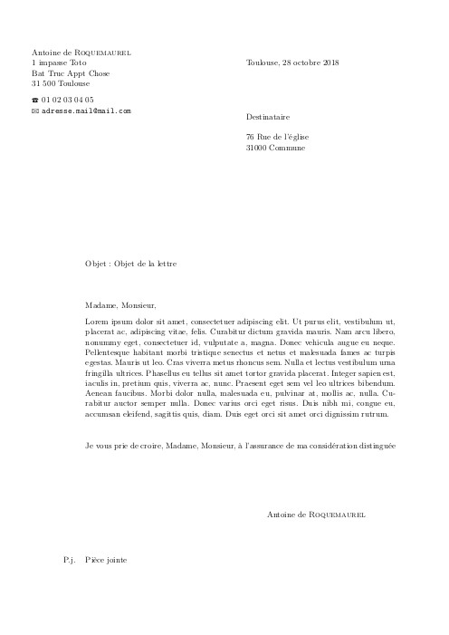

Template-Lettre-LaTeX
=====================

Un template permettant de rédiger des courriers en français. 

- default.ins contient les informations de l'émetteur
- lettre.cls contient le thème
- example.tex contient un example de courrier rédigé
- marvosym.sty permett d'avoir des pictogrammes

